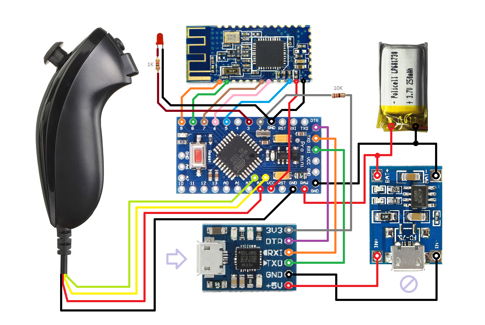

# bt-nunchuk
Bluetooth controller based on Wii Nunchuk, Arduino and HM10-like Bluetooth module.

---

#### Hardware design

---

#### Bill of materials
 - CJMCU CP2012 USB-Serial converter;
 - TP4056 LiPo charger;
 - LiPo battery;
 - Arduino Pro Mini 3.3V;
 - HM-10 Bluetooth module (or clone);
 - Wii Nunchuk.
